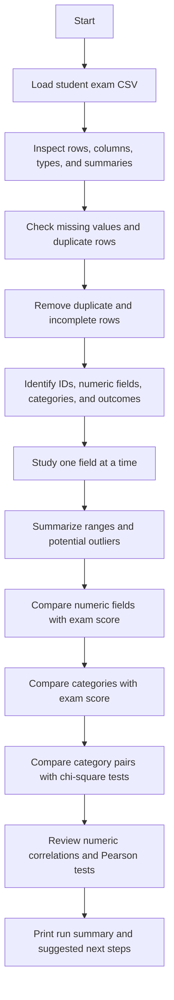

# Student Exam Performance: EDA Guide

This guide explains what `student-exam.py` does and why, using everyday language alongside the programming terms. It is for readers who are new to data analysis as well as programmers who want to understand the workflow.

## What Is EDA?

Exploratory Data Analysis (EDA) is the process of looking carefully at data before making decisions or building a machine-learning model. It helps answer questions such as:

- What information is in the dataset?
- Is any information missing or repeated?
- What do the values usually look like?
- Which things appear to move together?

EDA can reveal patterns and possible problems. By itself, it does not prove that one thing causes another, and this script does not train a machine-learning model.

## Flow Diagram



## Why These Steps?

| Step | What the script does | Why it matters |
|---|---|---|
| 1. Load the dataset | Reads `student_exam_performance.csv` into a pandas table called `df`. | Analysis needs the data in memory. The script also reports how many rows and columns were loaded. |
| 2. Understand the data | Displays sample rows, shape, column names, data types, and descriptive statistics. | This is an initial orientation: it helps catch unexpected columns, formats, or value ranges before analysis. |
| 3. Check data quality | Counts missing values and duplicate rows. It makes a copy, then removes duplicate rows and rows containing any missing value. | Repeated or incomplete records can affect summaries and comparisons. Cleaning creates `df_cleaned` for the later steps. |
| 4. Identify field types | Lists the student ID, numeric columns, categorical input features, and outcome columns. | Different kinds of data need different summaries and charts. An ID identifies a record; it is not a useful measurement of performance. |
| 5. Analyze numeric fields one at a time | Prints statistics and draws a histogram and boxplot for each listed numeric field. | Shows typical values, spread, shape, and possible unusual values for each measurement. |
| 6. Analyze categories one at a time | Prints category counts and draws a count chart for each categorical input feature. | Shows which groups or labels are common and whether some categories have very few records. |
| 6.1. Examine outcomes | Counts and charts `performance_grade`, `pass_status`, and `performance_level`. | Shows how outcome groups are distributed. A very small group can make later comparisons less reliable. |
| 7. Summarize ranges and potential outliers | Calculates the five-number summary and counts values outside an IQR-based range for each numeric field. | Provides a consistent way to flag values that deserve checking; a flagged value is not automatically an error. |
| 8. Compare numeric fields | Draws scatterplots and reports correlation for selected fields against `exam_score`. | Helps show whether pairs of measurements have a roughly increasing, decreasing, or unclear relationship. |
| 9. Compare categories with exam score | Reports count, mean, median, and standard deviation of `exam_score` within selected categories, then draws boxplots. | Makes it easier to compare score distributions across groups, such as study methods or sleep quality. |
| 10. Compare category pairs | Builds count tables, runs chi-square tests, and draws stacked percentage charts for selected pairs. | Checks whether the observed category mix differs across groups more than might be expected by chance. |
| 11. Analyze correlations | Prints a numeric correlation matrix and heatmap, ranks relationships with `exam_score`, and runs Pearson tests. | Offers a compact overview of linear relationships and statistical evidence for each numeric field's relationship with the score. |
| 12. Summarize the run | Prints row counts, feature counts, the main target, and possible next project steps. | Gives a short end-of-run checklist and clarifies that training and evaluation are outside this script. |

## Important Terms

### Rows, columns, features, and outcomes

- A **row** is one record, typically one student's record.
- A **column** is one piece of information, such as `study_hours_per_day` or `exam_score`.
- A **feature** is information that may help explain or predict an outcome.
- An **outcome** (also called a target) is the result being studied. The script focuses on numeric `exam_score` and also summarizes `performance_grade`, `pass_status`, and `performance_level`.
- An **ID** such as `student_id` identifies a record. Its number does not mean that the student has more or less of a measurable quality.

### Numeric and categorical data

- **Numeric data** represents quantities or numbers, such as exam score, attendance percentage, and study hours.
- **Categorical data** represents labels or groups, such as gender, family income group, or study method.
- Some numeric-looking values are really labels. For example, a code of `1` for one category and `2` for another does not necessarily mean category 2 is twice category 1. The script's numeric/categorical lists are partly defined by the author, so check them against the dataset's meaning.

### Univariate and bivariate analysis

- **Univariate** means studying one variable (one column) at a time. A histogram of study hours is an example.
- **Bivariate** means studying two variables together. A chart of study hours versus exam score is an example.

## What Is Correlation?

Correlation is a number describing how strongly and in what direction two numeric variables move together in a **linear** way. This script uses Pearson correlation, whose value ranges from `-1` to `+1`:

| Correlation | General interpretation |
|---:|---|
| Near `+1` | Higher values of one variable tend to go with higher values of the other. |
| Near `-1` | Higher values of one variable tend to go with lower values of the other. |
| Near `0` | There is little or no straight-line relationship. A curved or otherwise complex relationship may still exist. |

For example, a positive correlation between `previous_exam_score` and `exam_score` would mean students with higher previous scores tend to also have higher current scores in this dataset. It would **not** mean that the previous score caused the current score.

Correlation is not causation. Other factors may explain a pattern, and unusual values can affect the result. Always look at the scatterplot as well as the number. A correlation close to zero does not rule out every kind of relationship; it only suggests little linear relationship.

### Pearson correlation and p-value

The script uses `pearsonr` to calculate two results for each numeric field compared with `exam_score`:

- **Correlation (`r`)** describes the direction and strength of the linear relationship in the sample.
- **P-value** estimates how surprising a correlation at least this extreme would be if there were no linear relationship in the wider population, under the test's assumptions.

A small p-value (often compared with `0.05`) is commonly called statistically significant. It does not say the relationship is large, useful, or causal. With many tests, some small p-values can occur by chance. This script prints the p-values but does not label each Pearson result significant or not.

## Other Analyses in the Script

### Histograms and boxplots

- A **histogram** groups numeric values into ranges and shows how many observations fall in each range. It helps reveal common ranges, skew, gaps, or multiple clusters.
- A **boxplot** summarizes the middle of the data and displays values that may be far from the rest. It is a screening view, not a verdict that a value is wrong.
- The script's histograms include a KDE curve, a smoothed outline intended to help show the distribution's shape.

### Five-number summary and IQR

The five-number summary consists of the minimum, first quartile (Q1), median, third quartile (Q3), and maximum. The **interquartile range** is $IQR = Q3 - Q1$; it measures the spread of the middle half of the values.

The script flags values below $Q1 - 1.5 \times IQR$ or above $Q3 + 1.5 \times IQR$ as potential outliers. These are common statistical flags. A value might be a valid unusual student record, so investigate it before removing or changing it.

### Group summaries and boxplots

For selected categories, the script reports:

- **Count**: how many non-missing scores are in the group.
- **Mean**: the arithmetic average; extreme values can pull it up or down.
- **Median**: the middle score after sorting; it is less affected by extreme values.
- **Standard deviation**: a measure of how spread out scores are around their average.

Comparing these helps describe group differences, but does not establish that group membership caused a score difference.

### Chi-square test for category pairs

The script uses a **contingency table** to count combinations of two categories, such as `gender` and `pass_status`. The chi-square test asks whether the observed counts are consistent with the categories being independent (not associated) in the population.

- A small p-value, here below `0.05`, is reported as a statistically significant association.
- A large p-value means the data did not provide strong evidence of an association; it does not prove that there is no association.
- The test does not measure how strong or important an association is, and it does not establish cause and effect.
- Chi-square tests work best when expected counts are not too small. Check the expected counts (`expected` in the code) before relying on results for rare categories.

The stacked chart shows the percentage distribution of the second category within each group of the first category, making group mixes easier to compare visually.

## Reading the Correlation Matrix

The correlation matrix compares every listed numeric field with every other listed numeric field. Each cell is a correlation from `-1` to `+1`; the diagonal is `1` because each field is perfectly correlated with itself. The heatmap colors make stronger positive and negative values easier to spot.

The script then sorts numeric fields by their correlation with `exam_score` and prints the five strongest positive and negative correlations. These rankings are descriptive, not a list of proven causes or guaranteed predictors.

## Things to Keep in Mind

1. **Cleaning removes records.** `dropna()` removes an entire row if any column in that row is missing. If many rows are incomplete, this can discard useful information or change which students remain. Review the missingness before choosing a cleaning method.
2. **The original data is preserved in memory.** The script cleans a copy named `df_cleaned`; it does not overwrite the CSV file.
3. **The column lists are explicit.** The dataset must contain the columns named in the script. If the CSV changes, update the lists and comparison pairs as needed.
4. **Numeric encoding needs care.** Numeric codes for yes/no or ordered labels can make a correlation look meaningful even when the numeric distance between codes is not meaningful.
5. **Many comparisons are performed.** When many statistical tests are run, interpret p-values cautiously; some results may appear significant by chance.
6. **EDA is not prediction.** The script makes charts and statistical summaries only. It does not select a final predictive model, split training and test data, or evaluate model performance.
7. **Findings describe this dataset.** Sampling, data collection, and measurement quality affect whether patterns generalize to other students or schools.

## Running the Script

From this `EDA` folder, run:

```bash
python student-exam.py
```

The CSV is loaded using a relative filename, so running from this folder ensures the script can find `student_exam_performance.csv`. The script prints tables and opens charts as it progresses.

## What Could Come Next?

After reviewing the data and validating the findings, a separate machine-learning workflow could investigate feature engineering, a training/test split, model training, and evaluation. Those are intentionally outside the scope of `student-exam.py`.