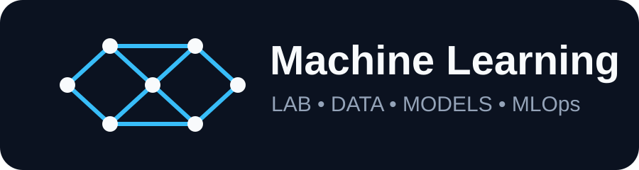

# 🧠 Machine Learning Lab

<div align="center">



### A structured, practical path from **Python & Statistics → EDA → Preprocessing → Machine Learning → Evaluation → MLOps → Deployment**

<p><a href="#-learning-path">Learning Path</a> • <a href="#-portfolio-projects">Projects</a> • <a href="#-repository-structure">Structure</a> • <a href="#-getting-started">Getting Started</a> • <a href="#-documentation">Docs</a></p>

[](https://www.python.org/)
[](https://numpy.org/)
[](https://pandas.pydata.org/)
[](https://scikit-learn.org/)
[](https://jupyter.org/)
[](https://github.com/amitweb2012/machine-learning-lab/actions/workflows/ci.yml)
[](LICENSE)

</div>

---

## 🎯 What this repository is

**Machine Learning Lab** is a portfolio-focused learning repository built as a progression rather than a collection of disconnected examples.

> **Understand the mathematics → inspect the data → prepare the data → build models → evaluate evidence → turn experiments into reusable ML systems.**

| Stage | Question | Repository area |
|---|---|---|
| 🐍 01 | Can I work confidently with Python and data tools? | [Python Foundation](01-python-foundation/) |
| 📐 02 | Can I reason about data mathematically? | [Statistics](02-statistics/) |
| 📊 03 | Can I discover patterns and data-quality issues? | [Data Analysis & EDA](03-data-analysis/) |
| 🧹 04 | Can I transform raw data reproducibly? | [Data Preprocessing](04-data-preprocessing/) |
| 🤖 05 | Can I build predictive models? | [Supervised Learning](05-supervised-learning/) |
| 🔎 06 | Can I discover structure without labels? | [Unsupervised Learning](06-unsupervised-learning/) |
| 🌲 07 | Can I combine weak learners into stronger models? | [Ensemble Learning](07-ensemble-learning/) |
| 📈 08 | Can I measure model performance correctly? | [Model Evaluation](08-model-evaluation/) |
| 🧪 09 | Can I apply the full workflow to projects? | [ML Projects](09-ml-projects/) |
| 🧩 10 | Can I make training reproducible? | [ML Pipelines](10-ml-pipelines/) |
| 🚀 11 | Can I package and serve a model? | [Deployment](11-deployment/) |

---

## 🗺️ Learning Path

```text
Python
  │
  ▼
Statistics & Probability
  │
  ▼
Data Analysis / EDA
  │
  ▼
Data Preprocessing
  │
  ├───────────────┐
  ▼               ▼
Supervised     Unsupervised
Learning        Learning
  │               │
  └───────┬───────┘
          ▼
   Ensemble Learning
          │
          ▼
    Model Evaluation
          │
          ▼
    Portfolio Projects
          │
          ▼
     ML Pipelines
          │
          ▼
       Deployment
```

---

## 🧪 Portfolio Projects

| Project | Type | Focus | Status |
|---|---|---|---|
| [Insurance Cost Prediction](09-ml-projects/insurance-cost-prediction/) | Regression | EDA, preprocessing, regression, evaluation | 🚧 Building |
| [House Price Prediction](09-ml-projects/house-price-prediction/) | Regression | Feature engineering, preprocessing, model comparison | 🚧 Planned |
| [Customer Churn](09-ml-projects/customer-churn/) | Classification | Imbalance, precision/recall, ROC-AUC, explainability | 🚧 Planned |
| [Fraud Detection](09-ml-projects/fraud-detection/) | Classification | Imbalance, leakage prevention, business error analysis | 🚧 Planned |

> **Status note:** “Planned” and “Building” describe the repository scope and implementation stage; they do not mean every workflow listed in a project description is already implemented.

---

## 🔬 Core ML Workflow

```text
Business Problem
      ↓
Data Collection
      ↓
Data Understanding
      ↓
EDA & Data Quality
      ↓
Preprocessing
      ↓
Feature Engineering
      ↓
Train / Validate / Test
      ↓
Model Training
      ↓
Evaluation & Error Analysis
      ↓
Explainability
      ↓
Packaging / Pipeline
      ↓
Deployment & Monitoring
```

---

## 🧰 Technology Stack

| Area | Tools |
|---|---|
| Language | Python |
| Numerical Computing | NumPy |
| Data Analysis | Pandas |
| Visualization | Matplotlib, Seaborn |
| Machine Learning | scikit-learn |
| Gradient Boosting | XGBoost, LightGBM |
| Notebooks | Jupyter |
| Reproducibility | Joblib, pytest |
| Automation | GitHub Actions |
| Serving | FastAPI |
| Packaging | Docker |

---

## 🧱 Repository Structure

```text
machine-learning-lab/
│
├── 01-python-foundation/
├── 02-statistics/
├── 03-data-analysis/
├── 04-data-preprocessing/
├── 05-supervised-learning/
├── 06-unsupervised-learning/
├── 07-ensemble-learning/
├── 08-model-evaluation/
│
├── 09-ml-projects/
│   ├── insurance-cost-prediction/
│   ├── house-price-prediction/
│   ├── customer-churn/
│   ├── fraud-detection/
│   └── PROJECT_TEMPLATE.md
│
├── 10-ml-pipelines/
├── 11-deployment/
│
├── docs/
├── assets/
├── tests/
├── .github/workflows/
│
├── README.md
├── requirements.txt
├── pyproject.toml
├── CONTRIBUTING.md
└── LICENSE
```

---

## 🚀 Getting Started

### 1. Clone

```bash
git clone https://github.com/amitweb2012/machine-learning-lab.git
cd machine-learning-lab
```

### 2. Create a virtual environment

macOS / Linux:

```bash
python -m venv .venv
source .venv/bin/activate
```

Windows:

```powershell
python -m venv .venv
.venv\Scripts\activate
```

### 3. Install dependencies

```bash
pip install -r requirements.txt
```

### 4. Run tests

```bash
pytest
```

### 5. Recommended learning sequence

```text
02-statistics → 03-data-analysis → 04-data-preprocessing
        ↓
05-supervised-learning → 08-model-evaluation → 09-ml-projects
```

---

## 📖 Documentation

- [Machine Learning Roadmap](docs/roadmap.md)
- [Algorithms Reference](docs/algorithms.md)
- [Statistics Formula Sheet](docs/statistics-formulas.md)
- [ML Interview Questions](docs/interview-questions.md)
- [Project Template](09-ml-projects/PROJECT_TEMPLATE.md)

---

## ✨ Repository Principles

**Learn the concept.** Major topics should have a clear explanation.

**Show the mathematics.** Important statistics and ML ideas should include formulas and intuition.

**Write runnable code.** Examples should be executable and easy to inspect.

**Keep workflows reproducible.** Use consistent preprocessing, tests, and automation.

**Separate learning from projects.** Numbered sections teach individual ideas; `09-ml-projects` combines them into portfolio-oriented applications.

**Prefer evidence over assumptions.** EDA, statistical testing, and model evaluation should support conclusions with measurable results.

---

## 💼 Portfolio Focus

This repository demonstrates the progression:

**Python → Mathematics → Data Understanding → Preprocessing → Modeling → Evaluation → Reproducibility → Deployment**

The objective is not simply to collect algorithms, but to show how they fit into an end-to-end Machine Learning workflow.

---

<div align="center">

### Built as a practical Machine Learning learning lab

**Amit Das** · [GitHub](https://github.com/amitweb2012)

</div>

---

## 📄 License

This project is licensed under the MIT License. See [LICENSE](LICENSE).